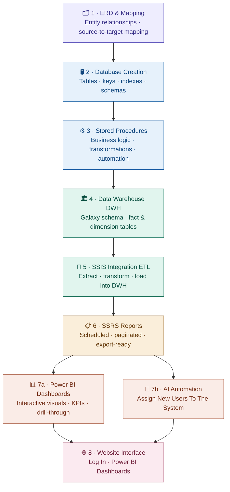

# 🚀 Proplytics

<p align="center">
  
</p>

<p align="center">
  
</p>

<p align="center">
  
  
  
  
</p>

---

# 📌 About The Project

## Proplytics

**Proplytics** is an integrated **Real Estate Analytics & Management System** designed to help real estate companies make smarter, data-driven decisions.

The platform combines operational management with advanced business intelligence to provide a complete view of:

- 🏢 Property Operations
- 📊 Business Analytics
- 📈 Market Trends
- 👥 Customer & Agent Performance
- 💰 Revenue & Pricing Insights

Unlike traditional property listing systems, **Proplytics** transforms raw real estate data into actionable insights that support strategic planning, operational efficiency, and business growth.

<p align="center">
  
</p>

---

# 🏗️ System Architecture

End-to-end Power BI project pipeline — from data modeling to user-facing interface.


---

# 📊 Key Features

## 🏢 Operational Management

- Property management
- Sales operations
- Customer tracking
- Agent management

## 📈 Analytics & Reporting

- Market trend analysis
- Revenue insights
- Sales performance tracking
- Customer behavior analysis
- Interactive dashboards

## 📊 Business Intelligence

- KPI monitoring
- Forecasting support
- Executive reporting
- Data-driven decision making

---

# 🛠️ Technology Stack

| Technology | Purpose |
|------------|----------|
| SQL Server | Database & Data Warehouse |
| SSIS | ETL & Data Integration |
| SSRS | Reporting Services |
| Power BI | Interactive Dashboards & Visualization |

---

# 📂 Project Structure

```bash
Proplytics/
│
├── Mapping/
├── ERD/
├── DataWarehouse/
│
├── SSIS/
├── SSRS/
├── Dashboards/
│
├── docs/
│   └── images/
│
└── README.md
```

---

# 📊 Dashboard & Reporting Capabilities

✔ Executive KPI Dashboards  
✔ Sales & Revenue Analysis  
✔ Property Performance Tracking  
✔ Customer Insights  
✔ Agent Productivity Monitoring  
✔ Market Trend Visualization  
✔ Forecasting & Strategic Reporting  

---

# 🎯 Project Goals

- Centralize real estate operational data
- Improve reporting efficiency
- Support executive decision-making
- Enable advanced analytics & insights
- Build scalable BI architecture

---


---

# 👨‍💻 Team Vision

Proplytics was built with the vision of combining **Real Estate Operations** with **Business Intelligence** to create a smarter, insight-driven ecosystem for modern real estate companies.

---

# ⭐ Support

If you like this project, consider giving it a ⭐ on GitHub!
