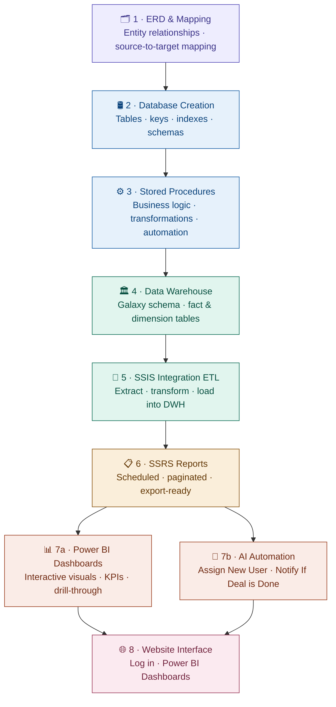
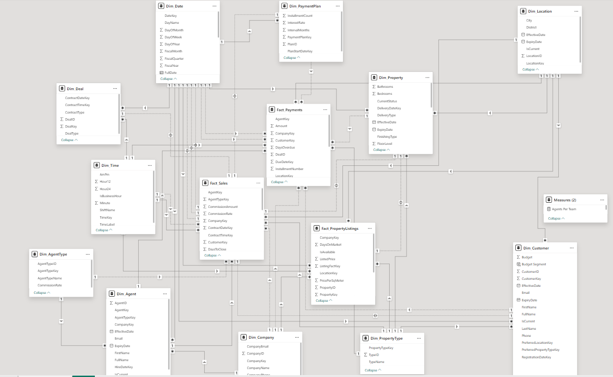
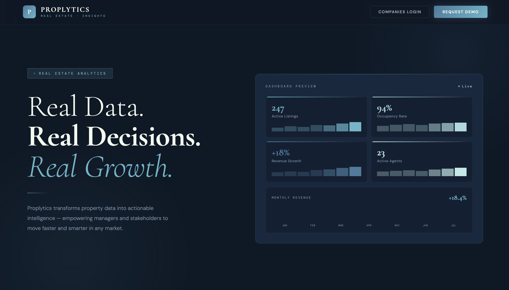
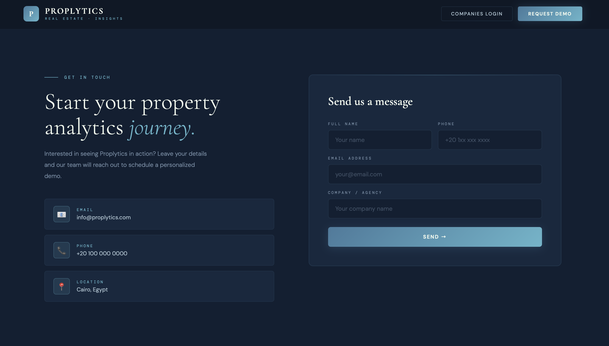
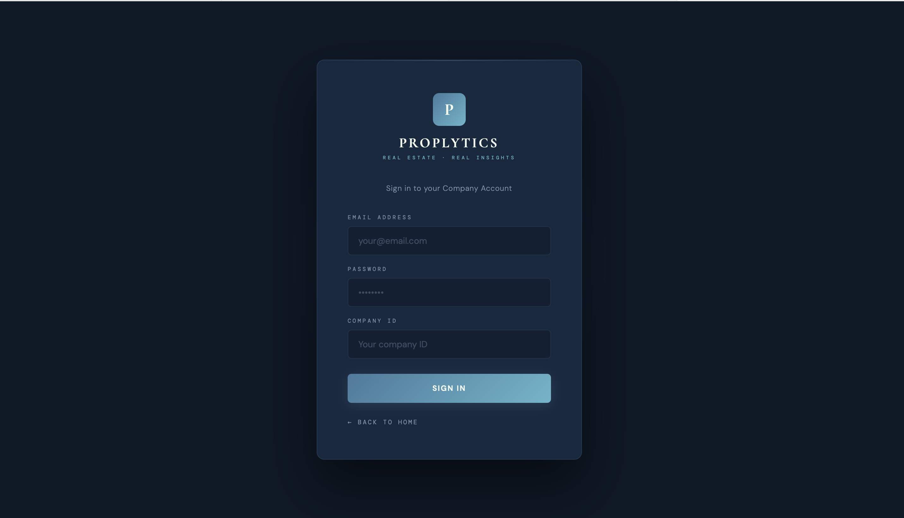
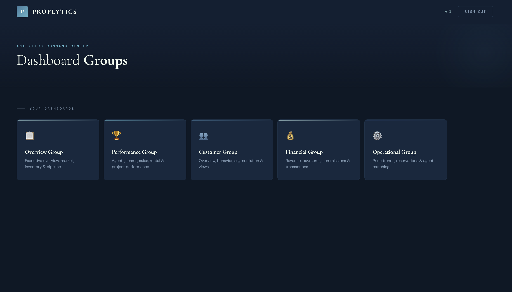

# 🚀 Proplytics
<p align="center">
  
  </p>
<p align="center">
  
</p>

<p align="center">
  
</p>

<p align="center">
  
  
  
  
  
  
  
  
  
  
  
  
</p>


---

# 📌 About The Project

## Proplytics

**Proplytics** is an integrated **Real Estate Analytics & Management System** designed to help real estate companies make smarter, data-driven decisions.

The platform combines operational management with advanced business intelligence to provide a complete view of:

- 🏢 Property Operations
- 📊 Business Analytics
- 📈 Market Trends
- 👥 Customer & Agent Performance
- 💰 Revenue & Pricing Insights

Unlike traditional property listing systems, **Proplytics** transforms raw real estate data into actionable insights that support strategic planning, operational efficiency, and business growth.

<p align="center">
  
</p>

---
# 🏗️ System Architecture

End-to-end Power BI project pipeline — from data modeling to user-facing interface.


---
# 📊 Key Features

## 🏢 Operational Management

- Property management
- Sales operations
- Customer tracking
- Agent management

## 📈 Analytics & Reporting

- Market trend analysis
- Revenue insights
- Sales performance tracking
- Customer behavior analysis
- Interactive dashboards

## 📊 Business Intelligence

- KPI monitoring
- Executive reporting
- Data-driven decision making

---

## Technology stack
 
<p align="center">
  
  
  
  
  
  
  
  
  
  
  
  
</p>

| Technology | Category | Purpose |
|------------|----------|---------|
| SQL Server | Database | Relational database & data warehouse |
| SSIS | ETL | Data pipelines & integration |
| SSRS | Reporting | Paginated operational reports |
| Power BI | Visualization | Interactive dashboards & KPIs |
| Google Apps Script | Backend | Web application logic & automation |
| Supabase | Backend | Authentication & real-time database |
| JavaScript / HTML / CSS | Frontend | Website interface & styling |
| Python | Scripting | Data processing & automation scripts |
| draw.io | Design | ERD & architecture diagrams |
| GitHub | DevOps | Version control & project hosting |
 


 
---
 

## Project structure
 
```
Proplytics/
│
├── Database/            # Tables, stored procedures, indexes
├── DataWarehouse/       # Galaxy schema, fact & dimension tables
│   └── images/
├── ERD/                 # Entity relationship diagram
├── Mapping/             # Mapping diagram
├── Normalization/       # Normalization diagram
|
├── SSIS/                # ETL packages (.dtsx)
├── SSRS/                # Report files (.rdl)
├── Dashboards/          # Power BI files (.pbix)
│   └── images/
│
├── Website/             # Frontend interface
│   └── images/
├── AI-Automation/       # Automation scripts and flows
│   └── images/
│
├── docs/
│   └── images/
│
└── README.md
```
 
---

# 🗂️ ERD (Entity Relationship Diagram)

Database relationships, entities, keys, and normalization structure.

<p align="center">
  
</p>

---

# 🔄 Source To Target Mapping

Business rules, transformation logic, and source-to-destination mapping process.

<p align="center">
  
</p>

---

# 🏛️ Data Warehouse Architecture

Galaxy schema implementation using fact and dimension tables.

<p align="center">
  
</p>

## 📌 Included Components

- Fact Tables
- Dimension Tables
- Historical Tracking
- Star / Galaxy Schema
- Analytical Data Modeling

---

# 🔄 SSIS ETL Process

End-to-end ETL pipelines built using SQL Server Integration Services (SSIS).

## ⚙️ ETL Workflow

- Data Extraction
- Data Cleaning
- Data Transformation
- Loading Into Data Warehouse
- Automated Processing

<table align="center">
  <tr>
    <td>
      
    </td>
    <td>
      
    </td>
  </tr>
</table>

---

# 📋 SSRS Reports

Paginated, export-ready operational reports built using SQL Server Reporting Services.

## 📊 Reports Included

- Sales Reports
- Revenue Reports
- Property Reports
- Customer Reports
- Agent Performance Reports

<p align="center">
  
  
</p>
---

# 📊 Power BI Dashboards

Interactive dashboards designed for business intelligence, analytics, and executive decision-making.

## 📈 Dashboard & Reporting Capabilities

✔ Executive KPI Dashboards  
✔ Revenue & Sales Analysis  
✔ Property Performance Tracking  
✔ Customer Insights & Segmentation  
✔ Agent Productivity Monitoring  
✔ Market Trend Visualization  
✔ Forecasting & Strategic Reporting  
✔ KPI Monitoring & Drill-through Analysis  

<p align="center">
  
  
  
  
  
</p>

---
# ⚡ AI-Powered Automation Features

Two automated workflows were built and deployed using **SQL Server**, **Make.com**, and **Gmail** to eliminate manual operations in the customer assignment and deal reporting processes.

> **Why Webhook?**
> SQL Server runs on **localhost** — not accessible from the internet. Make.com is a cloud platform.
> The solution uses a **Webhook**: Make.com provides a public HTTPS URL, and SQL Server **pushes data TO it** the moment a database event occurs. Make.com receives the data and triggers the Gmail notification automatically.
>
> ```
> Without Webhook:  Make → (fails) → SQL Server on localhost
> With Webhook:     Make ← (POST) ← SQL Server pushes data
> ```

---

## 👤 Workflow 1 — Smart Customer Assignment

### Business Problem
When a new customer registered, a manager had to **manually** check all agents, review their workload, and assign the most suitable one — slow, error-prone, and causing uneven workload distribution.

### Solution
The moment a new customer is inserted into `Dim_Customer`, the system automatically selects the agent with the fewest assigned customers, saves the assignment to the database, and emails the agent with the customer's full details — **zero manual effort**.

### How It Works — Step by Step

```
New customer inserted into Dim_Customer
            ↓
Trigger fires automatically (AFTER INSERT)
            ↓
Stored Procedure runs
            ↓
Finds agent with fewest assigned customers
            ↓
Updates AssignedAgentKey in Dim_Customer
            ↓
Sends JSON to Make.com Webhook
            ↓
Make.com sends email to assigned Agent ✅
```

### Workflow Architecture


### Agent Selection Logic

```sql
-- Selects the agent with the fewest assigned customers
SELECT TOP 1 da.AgentKey
FROM Dim_Agent da
LEFT JOIN Dim_Customer dc ON da.AgentKey = dc.AssignedAgentKey
WHERE da.IsCurrent = 1
GROUP BY da.AgentKey
ORDER BY COUNT(dc.CustomerKey) ASC;
```

### SQL Components Built

| Component | Name | Purpose |
|-----------|------|---------|
| Column | `AssignedAgentKey` | Added to `Dim_Customer` to store assigned agent |
| Stored Procedure | `sp_AssignAgentAndNotify` | Selects agent, updates DB, sends webhook |
| Trigger | `trg_CustomerInsert` | `AFTER INSERT` on `Dim_Customer` — fires automatically |

### Make.com Setup

```
Module 1: Custom Webhook  ──►  Module 2: Gmail
          │                              │
          └── Receives JSON              └── To: AgentEmail
              from SQL Server                Subject: New Customer Assigned: {FullName}
                                             Body: Customer details (HTML)
```

### Email Received by Agent

```
Subject: New Customer Assigned: Nour Ahmed

Dear Amal Hamdy,

A new customer has been assigned to you:
  Customer Name:  Nour Ahmed
  Email:          nour.ahmed@gmail.com
  Phone:          01555555555
  Budget:         650,000 EGP

Please contact the customer as soon as possible.
Best regards, Proplytics System
```

<p align="center">
  
</p>

### ✅ Business Impact

| Feature | Benefit |
|---------|---------|
| ⚡ Instant Assignment | Customer assigned the second they register |
| ⚖️ Smart Distribution | Always picks the agent with fewest customers |
| 🔄 Zero Manual Work | No manager intervention needed |
| 📧 Auto Notification | Agent emailed immediately with full details |

---

## 🤝 Workflow 2 — Deal Closure Notification

### Business Problem
When a deal was closed, managers had **no automatic visibility**. Agents had to remember to report manually — causing delays, communication gaps, and missed transactions.

### Solution
The moment `DealStatus` changes to `Completed` in `Fact_Sales`, the system automatically fetches the full deal details and emails the manager instantly — **real-time, no manual reporting**.

### How It Works — Step by Step

```
DealStatus updated to 'Completed' in Fact_Sales
            ↓
Trigger fires automatically (AFTER UPDATE)
            ↓
Compares old value vs new value
(only fires if status CHANGED to Completed)
            ↓
Stored Procedure fetches deal details
(Customer + Agent + Amount + Commission)
            ↓
Sends JSON to Make.com Webhook
            ↓
Make.com sends email to Manager ✅
```

### Workflow Architecture


### Trigger Change Detection

```sql
-- 'inserted' = new values after UPDATE
-- 'deleted'  = old values before UPDATE
-- Only fires when DealStatus actually CHANGES to Completed
IF EXISTS (
    SELECT 1 FROM inserted i
    JOIN deleted d ON i.SalesFactKey = d.SalesFactKey
    WHERE i.DealStatus = 'Completed'
      AND d.DealStatus != 'Completed'
)
```

### SQL Components Built

| Component | Name | Purpose |
|-----------|------|---------|
| Stored Procedure | `sp_NotifyDealClosure` | JOINs 3 tables, builds JSON, sends webhook |
| Trigger | `trg_DealClosure` | `AFTER UPDATE` on `Fact_Sales` — detects status change |

### Make.com Setup

```
Module 1: Custom Webhook  ──►  Module 2: Gmail
          │                              │
          └── Receives JSON              └── To: Manager Email
              from SQL Server                Subject: Deal Closed: {CustomerName} - {TotalAmount} EGP
                                             Body: Full deal summary (HTML)
```

### Email Received by Manager

```
Subject: Deal Closed: Hassan Hafez - 2,500,000 EGP

Dear Manager,

A deal has been successfully closed:
  Deal ID:            14
  Customer Name:      Hassan Hafez
  Agent Name:         Osama Nasser
  Total Amount:       2,500,000 EGP
  Commission Amount:  87,500 EGP

Best regards, Proplytics System
```

<p align="center">
  
</p>

### ✅ Business Impact

| Feature | Benefit |
|---------|---------|
| 👁️ Real-Time Visibility | Manager notified the second a deal closes |
| ⚡ Instant Communication | No waiting for manual reports |
| 📊 Full Transparency | Complete deal summary in every email |
| 🔄 Zero Manual Reporting | Fully automated end-to-end |


---

# 🛠️ Technologies Used

<p align="center">
  
  
  
  
  
</p>

| Technology | Purpose |
|---|---|
| SQL Server | Database operations & workflow triggers |
| Make.com | Workflow automation |
| Gmail API | Automated email notifications |
| OAuth Authentication | Secure email integration |
| MSXML2.ServerXMLHTTP | HTTP communication |

---

## Website / Application interface
 
Custom-built web application integrated with Power BI dashboards, role-based authentication, and a real-time Supabase backend.
 
**Features:**
 
| Feature |
|---------|
| 🔐 Login system | 
| 📊 Embedded Power BI | 
| 🧭 Dashboard navigation | 
| 📱 Responsive interface |
 
**Technologies used:**
 


 
<p align="center">
  
  
  
  

</p>
---

## 🎯 Project Goals

- Centralize real estate operational data
- Improve reporting efficiency
- Support executive decision-making
- Enable advanced analytics & insights
- Build scalable BI architecture

---
---

# 👨‍💻 Team Vision

Proplytics was built with the vision of combining **Real Estate Operations** with **Business Intelligence** to create a smarter, insight-driven ecosystem for modern real estate companies.

---

# ⭐ Support

If you like this project, consider giving it a ⭐ on GitHub!
