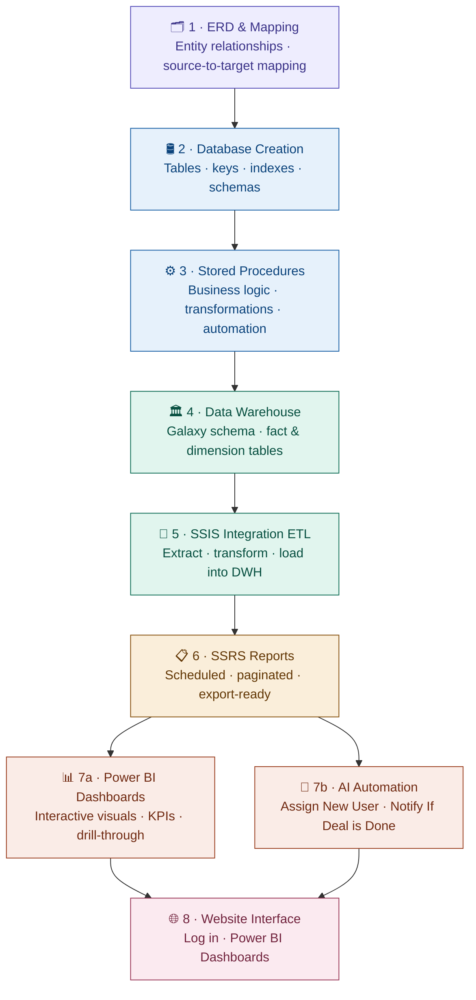
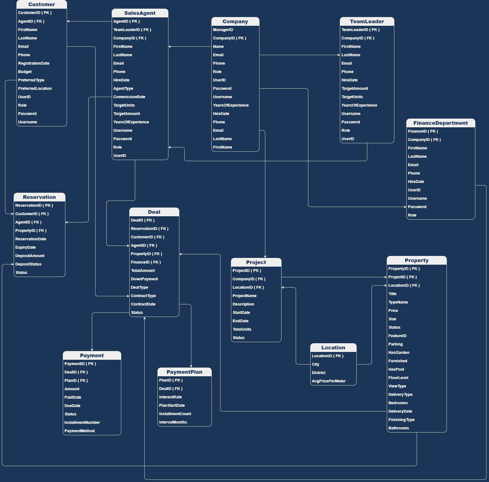

# 🚀 Proplytics

<p align="center">
  
</p>

<p align="center">
  
</p>

<p align="center">
  
  
  
  
  
  
  
  
  
  
  
  
</p>


---

# 📌 About The Project

## Proplytics

**Proplytics** is an integrated **Real Estate Analytics & Management System** designed to help real estate companies make smarter, data-driven decisions.

The platform combines operational management with advanced business intelligence to provide a complete view of:

- 🏢 Property Operations
- 📊 Business Analytics
- 📈 Market Trends
- 👥 Customer & Agent Performance
- 💰 Revenue & Pricing Insights

Unlike traditional property listing systems, **Proplytics** transforms raw real estate data into actionable insights that support strategic planning, operational efficiency, and business growth.

<p align="center">
  
</p>

---
# 🏗️ System Architecture

End-to-end Power BI project pipeline — from data modeling to user-facing interface.


---
# 📊 Key Features

## 🏢 Operational Management

- Property management
- Sales operations
- Customer tracking
- Agent management

## 📈 Analytics & Reporting

- Market trend analysis
- Revenue insights
- Sales performance tracking
- Customer behavior analysis
- Interactive dashboards

## 📊 Business Intelligence

- KPI monitoring
- Executive reporting
- Data-driven decision making

---

## Technology stack
 
<p align="center">
  
  
  
  
  
  
  
  
  
  
  
  
</p>

| Technology | Category | Purpose |
|------------|----------|---------|
| SQL Server | Database | Relational database & data warehouse |
| SSIS | ETL | Data pipelines & integration |
| SSRS | Reporting | Paginated operational reports |
| Power BI | Visualization | Interactive dashboards & KPIs |
| Google Apps Script | Backend | Web application logic & automation |
| Supabase | Backend | Authentication & real-time database |
| JavaScript / HTML / CSS | Frontend | Website interface & styling |
| Python | Scripting | Data processing & automation scripts |
| draw.io | Design | ERD & architecture diagrams |
| GitHub | DevOps | Version control & project hosting |
 


 
---
 

## Project structure
 
```
Proplytics/
│
├── Database/            # Tables, stored procedures, indexes
├── DataWarehouse/       # Galaxy schema, fact & dimension tables
│   └── images/
├── ERD/                 # Entity relationship diagram
├── Mapping/             # Mapping diagram
├── Normalization/       # Normalization diagram
|
├── SSIS/                # ETL packages (.dtsx)
├── SSRS/                # Report files (.rdl)
├── Dashboards/          # Power BI files (.pbix)
│   └── images/
│
├── Website/             # Frontend interface
│   └── images/
├── AI-Automation/       # Automation scripts and flows
│   └── images/
│
├── docs/
│   └── images/
│
└── README.md
```
 
---

# 🗂️ ERD (Entity Relationship Diagram)

Database relationships, entities, keys, and normalization structure.

<p align="center">
  
</p>

---

# 🔄 Source To Target Mapping

Business rules, transformation logic, and source-to-destination mapping process.

<p align="center">
  
</p>

---

# 🏛️ Data Warehouse Architecture

Galaxy schema implementation using fact and dimension tables.

## 📌 Included Components

- Fact Tables
- Dimension Tables
- Historical Tracking
- Star / Galaxy Schema
- Analytical Data Modeling

<p align="center">
  
</p>

---

# 🔄 SSIS ETL Process

End-to-end ETL pipelines built using SQL Server Integration Services (SSIS).

## ⚙️ ETL Workflow

- Data Extraction
- Data Cleaning
- Data Transformation
- Loading Into Data Warehouse
- Automated Processing

<p align="center">
  
</p>

---

# 📋 SSRS Reports

Paginated, export-ready operational reports built using SQL Server Reporting Services.

## 📊 Reports Included

- Sales Reports
- Revenue Reports
- Property Reports
- Customer Reports
- Agent Performance Reports

<p align="center">
  
</p>

---

# 📊 Power BI Dashboards

Interactive dashboards designed for business intelligence and executive decision-making.

## 📈 Dashboard Capabilities

✔ Executive Overview  
✔ Revenue Analytics  
✔ Sales Performance Tracking  
✔ Customer Insights  
✔ Property Analytics  
✔ Market Trend Analysis  
✔ KPI Monitoring  
✔ Drill-through Analysis  

<p align="center">
  
</p>

---
# ⚡ AI-Powered Automation Features

## 👤 Smart Customer Assignment

Automatically assigns newly registered customers to the most suitable real estate agent based on predefined business rules such as:

- 📍 Geographic Location
- ⚖️ Agent Workload Balance
- 🟢 Agent Availability

Once assignment is completed, the assigned agent instantly receives an automated email containing:

- Customer Information
- Contact Details
- Property Interest
- Assignment Details

---

### 🔄 Workflow Architecture


---

### ✅ Business Impact

| Feature | Benefit |
|---|---|
| ⚡ Faster Response Time | Immediate customer engagement |
| ⚖️ Smart Distribution | Balanced workload among agents |
| 🔄 Automation | Reduced manual operations |
| 📈 Efficiency | Improved operational performance |

---

## 🤝 Deal Closure Notification

Automatically detects completed property deals and instantly notifies management through real-time email alerts.

This workflow ensures immediate transaction visibility without relying on manual reporting processes.

---

### 🔄 Workflow Architecture


---

### ✅ Business Impact

| Feature | Benefit |
|---|---|
| 👁️ Visibility | Real-time transaction monitoring |
| ⚡ Communication | Instant management notifications |
| 📊 Transparency | Improved operational awareness |
| 🔄 Reporting | Reduced manual reporting dependency |

---

# 🛠️ Technologies Used

<p align="center">
  
  
  
  
  
</p>

| Technology | Purpose |
|---|---|
| SQL Server | Database operations & workflow triggers |
| Make.com | Workflow automation |
| Gmail API | Automated email notifications |
| OAuth Authentication | Secure email integration |
| MSXML2.ServerXMLHTTP | HTTP communication |

---

<p align="center">
  
</p>
# 📊 Dashboard & Reporting Capabilities

✔ Executive KPI Dashboards  
✔ Sales & Revenue Analysis  
✔ Property Performance Tracking  
✔ Customer Insights  
✔ Agent Productivity Monitoring  
✔ Market Trend Visualization  
✔ Forecasting & Strategic Reporting  

---

# 🎯 Project Goals

- Centralize real estate operational data
- Improve reporting efficiency
- Support executive decision-making
- Enable advanced analytics & insights
- Build scalable BI architecture

---


---

# 👨‍💻 Team Vision

Proplytics was built with the vision of combining **Real Estate Operations** with **Business Intelligence** to create a smarter, insight-driven ecosystem for modern real estate companies.

---

# ⭐ Support

If you like this project, consider giving it a ⭐ on GitHub!
